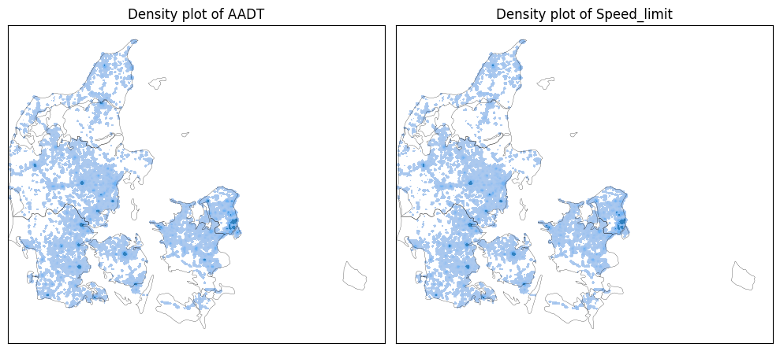
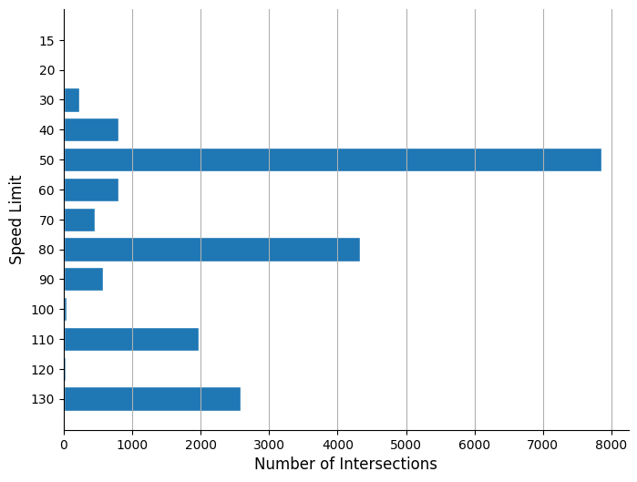
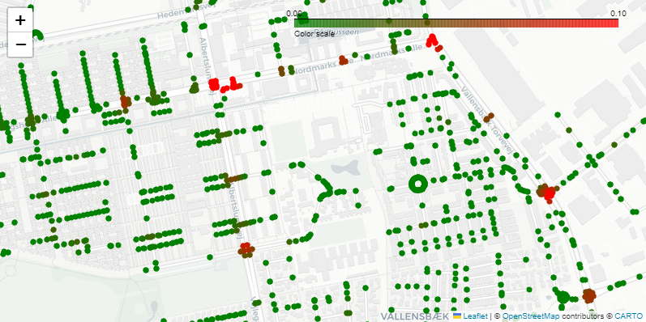

# Road Accident Risk Prediction using Machine Learning

Machine Learning project analysing Danish road network data to estimate the accident risk of street segments based on traffic intensity, road characteristics and spatial features.

The project combines geospatial analysis with predictive modelling to identify patterns that correlate with higher accident probability.

Developed as part of the Data Science & Machine Learning programme at Aalborg University.

---

# Motivation

Traffic accidents are influenced by multiple factors such as traffic volume, speed limits and spatial characteristics of road networks.

Understanding these relationships can help identify high-risk locations and support data-driven infrastructure planning.

This project explores whether machine learning models can predict the likelihood of accidents on a given road segment using publicly available Danish road and traffic data.

---

# Dataset

The dataset combines several sources:

- Danish road network data
- Annual Average Daily Traffic (AADT)
- Speed limit information
- Accident records from Danish traffic authorities

Each road segment is represented with spatial coordinates and several engineered features describing traffic intensity and road characteristics.

---

# Exploratory Data Analysis

## Traffic Density (AADT)

The following map visualises the spatial distribution of traffic density across Denmark.

Areas with high traffic intensity cluster around larger urban regions and major road corridors.

These areas are expected to have different accident risk characteristics compared to rural road segments.

---

## Speed Limit Distribution

The dataset contains multiple speed categories ranging from urban roads to highways.

Most road segments fall into the **50 km/h and 80 km/h categories**, representing typical urban and rural roads.

Higher speed limits (110–130 km/h) mainly correspond to highway segments.

---

# Feature Engineering

Several features were engineered from the raw data:

- traffic density (AADT)
- speed limit categories
- road segment length
- spatial proximity features
- intersection density

Geospatial processing was performed using Python geospatial libraries.

---

# Machine Learning Model

Several machine learning approaches were evaluated for predicting accident likelihood:

- Logistic Regression
- Random Forest
- Gradient Boosting

Models were trained using cross-validation to ensure robustness.

The goal was not only prediction accuracy but also identifying meaningful factors influencing accident risk.

---

# Example Prediction

Below is a prediction example from Copenhagen where the model highlights street segments with higher predicted accident probability.

Green segments represent lower predicted accident probability, while red segments indicate higher risk areas.

---

# Technology Stack

Python

Machine Learning
- Scikit-learn
- Pandas
- NumPy

Geospatial Analysis
- GeoPandas
- Shapely
- OpenStreetMap data

Visualization
- Matplotlib
- Folium / Leaflet maps

---

---

# Key Learnings

This project demonstrates how machine learning can be combined with geospatial data to analyse complex real-world systems.

Important challenges included:

- handling large spatial datasets
- feature engineering for road network data
- avoiding data leakage between road segments
- interpreting model predictions in a spatial context

---

# Author

Gonde Leon Winkelmann
Daniel Elsborg Johnsen
Gvidas Rimkus
Mikkel Kamp Rørbæk
Nikolai Kaaberbøl
Rasmus Bergman Vittrup Pedersen
BSc Data Science & Machine Learning  

LinkedIn: https://linkedin.com/in/gonde-winkelmann
